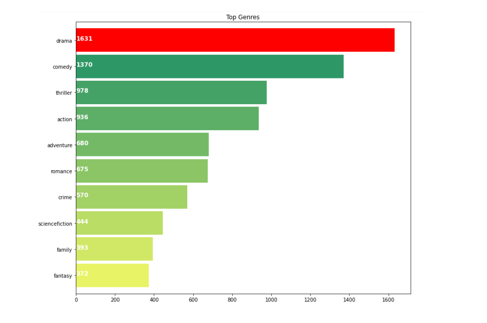
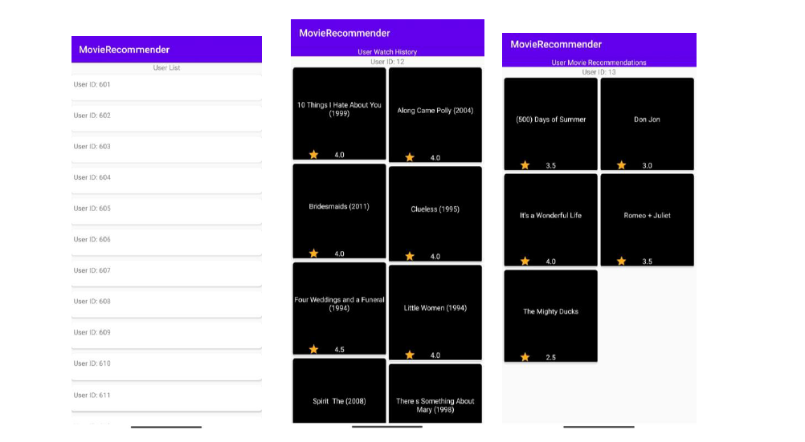
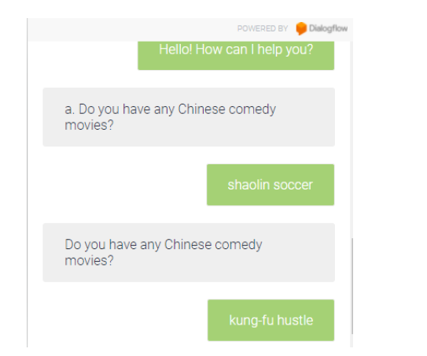

## Movie-Recommender-Chatbot

We worked on combing the results of the content-based recommender system and the collaborative filtering recommender system to get better recommendations and to solve some of the issues that face each type of the models.  

Merging two datasets: MovieLens dataset which contains 4 main tables ratings, movies, tags and links. TMDB dataset which contains two tables one for the movie information like overview, budget, revenues, and genres. The other one contains information about cast and crew.  

MovieLens dataset: https://grouplens.org/datasets/movielens/   
TMDB dataset: https://www.kaggle.com/datasets/tmdb/tmdb-movie-metadata  

A simple Android Application that can show the movie recommendations for different users:

Enabled Chatbot Using Google’s Dialogflow:

